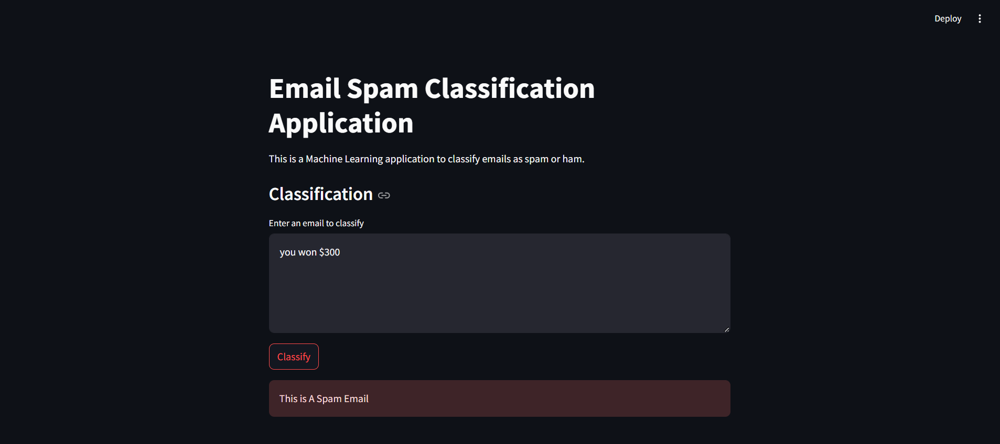

# Spam Mail Classification by NLP and ML

This project implements a spam email detection system using **Natural Language Processing (NLP)** and **Machine Learning (ML)** techniques. The system classifies emails as either **spam** or **ham** (non-spam) based on the content of the email.

The project utilizes the **Multinomial Naive Bayes classifier** and the **CountVectorizer** for text feature extraction. The model is deployed as a web application using **Streamlit** for real-time spam classification.

## Features
- Classifies emails as **spam** or **ham**.
- Built using **Machine Learning (Naive Bayes)** and **Natural Language Processing (NLP)** techniques.
- **Streamlit** app interface for real-time classification.
- **Pickle** used for saving and loading the trained model and vectorizer.

## Setup and Installation

1. **Clone the repository:**

```bash
   git clone https://github.com/HAMANPUREVAIBHAV/P3-Spam-Mail-Classification-by-NLP-and-ML
   cd Spam-Mail-Classification
   ```
# Create a virtual environment (optional but recommended):
```bash
    python -m venv venv
   ```

- source venv/bin/activate  # On Windows, use venv\Scripts\activate

## Install the required packages:

```bash
    pip install -r requirements.txt
   ```
   
# This will install the following dependencies:

- pandas
- numpy
- scikit-learn
- matplotlib
- streamlit
## Run the Streamlit app:

```bash
    streamlit run SpamDetector.py
   ```

- This will launch the application in your default web browser, allowing you to input email content and classify it as spam or ham.

## Dataset
- The dataset used for training the spam classification model is provided as spam.csv. It contains labeled email data with the following columns:

- Category: The label of the email (ham or spam).
- Message: The content of the email.
- How the Model Works
- The system uses CountVectorizer to transform the text data (email content) into a numerical format that the machine learning model can process.
- The Multinomial Naive Bayes classifier is trained on the processed data to classify emails as either ham or spam.
- The trained model and vectorizer are saved using pickle, which allows for easy loading and inference during app usage.
- Streamlit Interface
Here’s a preview of the Streamlit app interface for spam classification:


- The interface allows the user to input email content and receive a real-time classification as either spam or ham.
## Live Demo

You can access the live demo of the LMS [here](https://spam-mail-classification-by-nlp-and-ml-h9uzjh67wbxs59dnqq3y.streamlit.app/).

## Future Work
- Integrating deep learning models for better performance.
- Supporting multilingual email classification.
- Enhancing the user interface with more advanced features like batch processing.
- Implementing real-time data collection for model updates.

## License
- This project is licensed under the MIT License - see the LICENSE file for details.

## Acknowledgments
- Naive Bayes algorithm for classification.
- Streamlit for providing an easy-to-use interface for building the web app.
- The pandas, scikit-learn, and matplotlib libraries for data processing, model building, and visualization.


